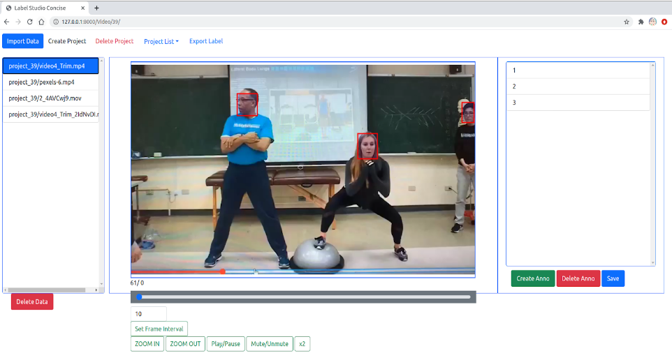

# label_studio_concise
This repo is built for reducing the label work. It could generate the label automatically by state-of-the-art model. All we need to do is to modify the uncorrect label, which reduce the label work dramatically.
## Face Detection Automatically

## Install
- First install django from https://www.djangoproject.com/download/
- Then clone the repo
```
git clone https://github.com/LiuZhenshun/label_studio_consise.git
```
- create database
```
python manage.py migrate
```
- Start the server at http://localhost:8080
```
python manage.py runserver
```
